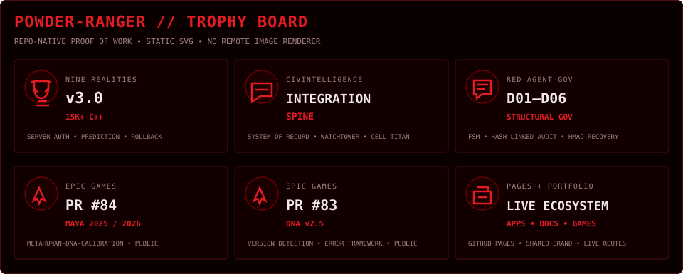

# Curtis Charles Farrar
### POWDER-RANGER · SYSTEMS ARCHITECT · AI GOVERNANCE · CIVIC INTELLIGENCE

[Portfolio](https://powder-ranger.github.io) · [Live Pages](https://powder-ranger.github.io/pages.html) · [Repository Browser](https://powder-ranger.github.io/repos.html) · [ORCID](https://orcid.org/0009-0008-9273-2458)

> **I architect systems that think, defend themselves, and serve the public good.**  
> Compliance is architectural. Security is not a feature — it is the foundation.

---

## CURRENT WORK · OCTOBER 2026

The active build is no longer a collection of unrelated experiments. The current center of gravity is the **CIVINTELLIGENCE integration spine**: a unified civic application with specialized Watchtower, Cell Titan, and operator-client rails.

| Current surface | What changed | Evidence |
|---|---|---|
| **[CIVINTELLIGENCE](https://github.com/POWDER-RANGER/CivilianIntelligence)** | Unified system of record; escalation/current platform status; cross-repo integration contract | [Latest commit](https://github.com/POWDER-RANGER/CivilianIntelligence/commit/85ebd2a436881cf223765f3c07fd83357e1e244e) |
| **[CIVWATCH App](https://github.com/POWDER-RANGER/civwatch-app)** | Integration spine merged into main | [Latest commit](https://github.com/POWDER-RANGER/civwatch-app/commit/c4c3567fb210a066111db244f6281347eaf319a0) |
| **[Cell Titan](https://github.com/POWDER-RANGER/civwatch-cell-titan)** | Integration spine merged into main | [Latest commit](https://github.com/POWDER-RANGER/civwatch-cell-titan/commit/22c69d78daf4485f986613141e61b99c9a2d7634) |
| **[Watchtower](https://github.com/POWDER-RANGER/civwatch-watchtower)** | CI validation blocker documented instead of hidden | [Latest commit](https://github.com/POWDER-RANGER/civwatch-watchtower/commit/3a828cbdaa7a3b57898ea44966f350c423637dd6) |

**Current acceptance state:** core integration is merged, but the CIVINTELLIGENCE repository explicitly withholds a production-readiness claim until CI, tests, builds, and security gates execute and pass.

---

## FLAGSHIP SYSTEMS · MOST ADVANCED

### 01 · [NINE REALITIES NETCODE](https://github.com/POWDER-RANGER/nine-realities-netcode)
**Distributed systems / Unreal Engine / multiplayer networking**

- **v3.0** Unreal Engine 5.5+ plugin with UE6 forward-compatibility path
- **15,000+ lines of C++** across runtime/editor modules
- Server-authoritative simulation with client prediction, rollback, reconciliation, adaptive synchronization
- Performance documentation and interactive GitHub Pages visualization
- **6 GitHub stars · 1 fork** currently

### 02 · [CIVINTELLIGENCE](https://github.com/POWDER-RANGER/CivilianIntelligence)
**Civic intelligence / public-data ingest / system integration**

- Unified civilian intelligence system of record
- Movement, oversight, finance, privacy, toolkit, Veil briefing, Watchtower and Cell Titan pillars
- Public-data ingest with traceable sources and explicit demo/snapshot/live/unavailable states
- Server-side integration boundaries and documented ownership/security contracts
- Eight-repository integration work now converging on one application center of gravity

### 03 · [RED-AGENT-GOV](https://github.com/POWDER-RANGER/RED-AGENT-GOV)
**Agent governance / deterministic enforcement**

- Deterministic finite-state execution
- D01–D06 output governance gates
- Hash-linked audit chain
- HMAC-backed recovery/integrity mechanisms
- Structural enforcement rather than prompt-level policy

### 04 · [OBLISK](https://github.com/POWDER-RANGER/OBLISK)
**Multi-agent AI / symbolic planning / secure state**

- Multi-agent lifecycle and role-based coordination
- AES-256-GCM encrypted vaults
- Symbolic goal decomposition and planning
- Policy enforcement and audit logging
- Event-driven messaging and observability

### 05 · [NSO KRYPTONITE](https://github.com/POWDER-RANGER/nso-kryptonite-platform)
**Adversarial defense / purple-team systems**

- Red / Blue / Purple / Spectator operating model
- React 19 + TypeScript + Vite + WebAssembly/WebGL surface
- Zero-trust infrastructure concepts, forensic reconstruction and detection engineering
- Integrated offense/defense accountability model

---

## ACHIEVEMENTS · PROOF OF WORK

### Epic Games / MetaHuman
I have two public contributions currently open in **[EpicGames/MetaHuman-DNA-Calibration](https://github.com/EpicGames/MetaHuman-DNA-Calibration)**:

- **[PR #84](https://github.com/EpicGames/MetaHuman-DNA-Calibration/pull/84)** — Maya 2025/2026 compatibility foundation
- **[PR #83](https://github.com/EpicGames/MetaHuman-DNA-Calibration/pull/83)** — preliminary DNA v2.5 version detection and user-facing error framework

### Credentials
- **C|OSINT|P — ZSecurity**, July 2025
- **Learn Network Hacking From Scratch (WiFi & Wired)** — Zaid Sabih / zSecurity, July 2025
- **Google Build with AI / AI Learning Lab**, July 2026
- **ORCID** [0009-0008-9273-2458](https://orcid.org/0009-0008-9273-2458)

### Unreal Engine
Independent Unreal work through **G6B-Elite Gaming Systems**, including Epic Developer Portal / Marketplace tooling and MetaHuman ecosystem contributions.

---

## TROPHIES · REPO-NATIVE PROOF

> The trophy board is stored directly in this repository, so the profile image is served by GitHub instead of a third-party image renderer. It is intentionally focused on concrete proof-of-work: advanced systems, current integration work, public engineering contributions, and live portfolio infrastructure.

---

## ACTIVITY · LIVE TELEMETRY

  

### Contribution Matrix

---

## GITHUB STATS · CAPABILITY SIGNAL

---

## STACK

**Architecture:** agent governance · distributed systems · civic data · zero-trust · observability · deterministic simulation · public-source intelligence

---

## LIVE ECOSYSTEM

| Domain | Repositories |
|---|---|
| **Civic Intelligence** | [CivilianIntelligence](https://github.com/POWDER-RANGER/CivilianIntelligence) · [civwatch-app](https://github.com/POWDER-RANGER/civwatch-app) · [civwatch-watchtower](https://github.com/POWDER-RANGER/civwatch-watchtower) · [civwatch-cell-titan](https://github.com/POWDER-RANGER/civwatch-cell-titan) |
| **AI & Governance** | [RED-AGENT-GOV](https://github.com/POWDER-RANGER/RED-AGENT-GOV) · [OBLISK](https://github.com/POWDER-RANGER/OBLISK) · [CharlesAI](https://github.com/POWDER-RANGER/CharlesAI) · [OBELISK-Desktop-AI](https://github.com/POWDER-RANGER/OBELISK-Desktop-AI) |
| **Defense** | [nso-kryptonite-platform](https://github.com/POWDER-RANGER/nso-kryptonite-platform) · [red-team-osint-tool](https://github.com/POWDER-RANGER/red-team-osint-tool) |
| **Simulation / Games** | [nine-realities-netcode](https://github.com/POWDER-RANGER/nine-realities-netcode) · [dojin-d](https://github.com/POWDER-RANGER/dojin-d) · [powder-ranger-bot](https://github.com/POWDER-RANGER/powder-ranger-bot) |
| **Tooling / Data** | [contextual-memory-ui](https://github.com/POWDER-RANGER/contextual-memory-ui) · [Artifact-Catalog](https://github.com/POWDER-RANGER/Artifact-Catalog) · [dollar-gravity-framework](https://github.com/POWDER-RANGER/dollar-gravity-framework) · [ai-nexus](https://github.com/POWDER-RANGER/ai-nexus) |
| **Creative Systems** | [RainGod-Comfy-Studio](https://github.com/POWDER-RANGER/RainGod-Comfy-Studio) · [RAINGOD-ComfyUI-Integration](https://github.com/POWDER-RANGER/RAINGOD-ComfyUI-Integration) · [raingod-studio-v4](https://github.com/POWDER-RANGER/raingod-studio-v4) |

---

## PRINCIPLES

1. **Governance is structural.** Put enforcement in the architecture.
2. **Local-first.** The operator owns the system; cloud is optional.
3. **Evidence before inference.** Keep provenance and uncertainty visible.
4. **Failures are data.** Broken experiments stay documented.
5. **Independent and self-funded.** Build in public, ship what survives.

---

## WORK WITH ME

Consulting and collaboration on agent governance, security engineering, civic-data tooling, distributed systems and Unreal-oriented systems work.

**Start here:** [powder-ranger.github.io](https://powder-ranger.github.io)

